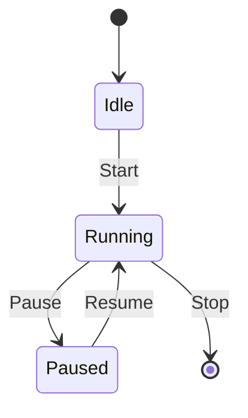

```markdown
# PromptHouse Evo Studio: Advanced Self-Evolution and Autonomous Automation Guide

## Table of Contents
1. [Introduction](#introduction)
2. [Advanced Self-Evolution](#advanced-self-evolution)
   - [Autonomous Self-Reflection](#autonomous-self-reflection)
   - [Code Refactoring Strategies](#code-refactoring-strategies)
   - [Logic Compaction Techniques](#logic-compaction-techniques)
3. [Autonomous Automation](#autonomous-automation)
   - [Background Daemons](#background-daemons)
   - [State Machines](#state-machines)
   - [Self-Healing Loops](#self-healing-loops)
4. [Recursive Tool Building](#recursive-tool-building)
5. [Measuring Intelligence (Sovereign Gain)](#measuring-intelligence-sovereign-gain)
   - [Quantifying Growth](#quantifying-growth)
   - [Driving Evolution](#driving-evolution)
6. [Conclusion](#conclusion)

## Introduction
This guide provides a comprehensive framework for enhancing the self-evolution and autonomous automation capabilities of the PromptHouse Evo Studio. By leveraging advanced strategies in self-reflection, automation, and recursive tool building, the studio can achieve unprecedented levels of efficiency and intelligence.

## Advanced Self-Evolution

### Autonomous Self-Reflection
Autonomous self-reflection is the cornerstone of self-evolution. It involves the system's ability to introspect and analyze its own codebase, identifying inefficiencies and areas for improvement.

#### System Prompt Template
```plaintext
"Analyze current codebase for inefficiencies. Identify redundant logic and suggest optimizations. Prioritize based on impact and feasibility."
```

### Code Refactoring Strategies
Refactoring is essential for maintaining a clean and efficient codebase. The studio should employ automated refactoring techniques to streamline its operations.

- **Pattern Recognition**: Use machine learning to identify common code patterns that can be optimized.
- **Modularization**: Break down monolithic code into smaller, reusable modules.

### Logic Compaction Techniques
Logic compaction involves reducing the complexity of algorithms without sacrificing functionality.

- **Algorithm Simplification**: Replace complex algorithms with simpler, more efficient ones.
- **Redundancy Elimination**: Remove duplicate logic and streamline decision-making processes.

## Autonomous Automation

### Background Daemons
Background daemons are essential for continuous operation. They monitor system health and perform routine maintenance tasks.

#### Best Practices
- **Resource Monitoring**: Ensure daemons have minimal impact on system resources.
- **Fault Tolerance**: Implement retry mechanisms and failover strategies.

### State Machines
State machines provide a robust framework for managing system states and transitions.

#### Architectural Diagram (Mermaid)


### Self-Healing Loops
Self-healing loops detect and correct errors autonomously, ensuring system stability.

- **Error Detection**: Implement comprehensive logging and monitoring.
- **Automated Recovery**: Develop scripts to automatically resolve common issues.

## Recursive Tool Building
The studio should be capable of building its own tools to enhance its functionality.

- **Audit Scripts**: Automatically generate scripts to audit code quality and performance.
- **Test Suites**: Develop adaptive test suites that evolve with the codebase.
- **Visual Processors**: Create tools for visualizing complex data and system states.

## Measuring Intelligence (Sovereign Gain)

### Quantifying Growth
Quantifying the system's growth is crucial for evaluating its evolution.

- **Line Coverage**: Measure the percentage of code executed during testing.
- **Logic Density**: Assess the complexity and efficiency of algorithms.
- **Successful Cycles**: Track the number of successful self-modification cycles.

### Driving Evolution
Use the data collected to inform the next evolution pass, focusing on areas with the highest potential for improvement.

## Conclusion
By implementing these advanced strategies, the PromptHouse Evo Studio can achieve a high level of autonomy and intelligence, continuously evolving to meet new challenges and opportunities.

```

This guide provides a structured approach to enhancing the capabilities of the PromptHouse Evo Studio, ensuring it remains at the forefront of autonomous AI development.