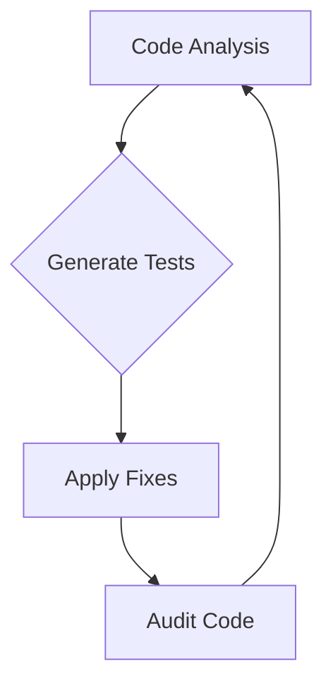

```markdown
# PromptHouse Evo Studio: High-Density Guide

## Table of Contents
1. [Vite](#vite)
   - Build Optimizations
   - HMR (Hot Module Replacement) Principles
   - Plugin Structures
   - Handling Asset Resolution
2. [Connections](#connections)
   - Bridge Server Orchestration
   - WebSocket/HTTP Communication Patterns
   - Maintaining State Across Disconnected Sessions
3. [APIs](#apis)
   - Secure Key Management
   - Exponential Backoff for Rate Limits
   - Payload Minimization
   - Fallback Strategies
4. [Autonomous IDEs](#autonomous-ides)
   - Principles of a Self-Evolving Development Environment
   - AI Reading Files and Generating Tests
   - Applying Fixes and Auditing Code

---

## Vite

### Build Optimizations
Vite leverages ES modules to provide a fast and efficient development experience. To optimize builds:

- **Code Splitting**: Use dynamic imports to split code into separate chunks.
- **Tree Shaking**: Ensure unused code is eliminated by configuring `package.json` with `"sideEffects": false`.
- **Minification**: Use terser for JavaScript minification and cssnano for CSS.

```javascript
// vite.config.js
import { defineConfig } from 'vite';

export default defineConfig({
  build: {
    minify: 'terser',
    rollupOptions: {
      output: {
        manualChunks(id) {
          if (id.includes('node_modules')) {
            return 'vendor';
          }
        }
      }
    }
  }
});
```

### HMR (Hot Module Replacement) Principles
HMR in Vite allows modules to be replaced without a full browser refresh:

- **State Preservation**: Ensure application state is preserved during updates.
- **Module Boundaries**: Define clear module boundaries to isolate changes.

### Plugin Structures
Plugins in Vite enhance functionality:

- **Creating a Plugin**: Use the `vite` plugin API to extend functionality.
- **Lifecycle Hooks**: Utilize hooks like `config`, `buildStart`, and `transform`.

```javascript
// vite-plugin-example.js
export default function examplePlugin() {
  return {
    name: 'example-plugin',
    transform(src, id) {
      if (id.endsWith('.js')) {
        return src.replace(/console\.log/g, 'console.warn');
      }
    }
  };
}
```

### Handling Asset Resolution
Vite resolves assets using a URL-based approach:

- **Public Directory**: Place static assets in the `public` directory.
- **Importing Assets**: Use relative paths or absolute paths starting with `/`.

## Connections

### Bridge Server Orchestration
Efficiently manage server connections:

- **Load Balancing**: Use Nginx or HAProxy for distributing load.
- **Session Management**: Implement sticky sessions for consistent user experience.

### WebSocket/HTTP Communication Patterns
Establish robust communication:

- **WebSocket**: Use for real-time updates and bidirectional communication.
- **HTTP**: Use for RESTful interactions and stateful operations.

```javascript
// WebSocket example
const socket = new WebSocket('ws://localhost:8080');
socket.onmessage = function(event) {
  console.log('Message from server ', event.data);
};
```

### Maintaining State Across Disconnected Sessions
Persist state using:

- **Local Storage**: Store critical session data locally.
- **IndexedDB**: Use for complex state persistence.

## APIs

### Secure Key Management
Protect API keys:

- **Environment Variables**: Store keys in `.env` files.
- **Redaction**: Ensure keys are not exposed in logs or error messages.

### Exponential Backoff for Rate Limits
Handle API rate limits gracefully:

- **Retry Strategy**: Implement exponential backoff for retries.

```javascript
function exponentialBackoff(retries) {
  return Math.min(1000 * 2 ** retries, 30000);
}
```

### Payload Minimization
Reduce payload size:

- **Selective Fields**: Request only necessary fields.
- **Compression**: Use gzip or Brotli for payload compression.

### Fallback Strategies
Implement fallback mechanisms:

- **Local Heuristic Core**: Use local logic when API fails.
- **Caching**: Cache responses to reduce API calls.

## Autonomous IDEs

### Principles of a Self-Evolving Development Environment
Design an IDE that adapts and evolves:

- **Modularity**: Ensure components can be updated independently.
- **AI Integration**: Use AI for code suggestions and optimizations.

### AI Reading Files and Generating Tests
Automate test generation:

- **Static Analysis**: Use AI to analyze code and generate test cases.
- **Test Coverage**: Ensure generated tests cover critical paths.

### Applying Fixes and Auditing Code
Ensure safe code modifications:

- **Version Control**: Use Git for tracking changes.
- **Code Audits**: Implement AI-driven audits to detect anomalies.



This guide serves as a comprehensive resource for mastering the integration of Vite, connections, APIs, and autonomous IDEs within the PromptHouse Evo Studio environment. By adhering to these principles and strategies, developers can create a robust, efficient, and self-sustaining development ecosystem.
```
